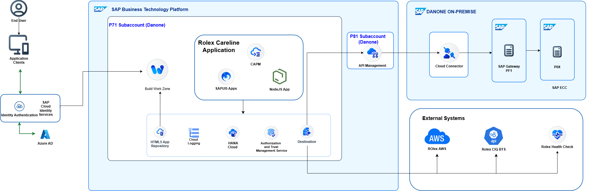

## Application Details
|               |
| ------------- |
|**Generation Date and Time**<br>Sun Mar 29 2026 13:04:51 GMT+0530 (India Standard Time)|
|**App Generator**<br>SAP Fiori Application Generator|
|**App Generator Version**<br>1.22.0|
|**Generation Platform**<br>Visual Studio Code|
|**Template Used**<br>Basic|
|**Service Type**<br>None|
|**Service URL**<br>N/A|
|**Module Name**<br>demotest|
|**Application Title**<br>App Title|
|**Namespace**<br>|
|**UI5 Theme**<br>sap_horizon|
|**UI5 Version**<br>1.146.0|
|**Enable TypeScript**<br>False|
|**Add Eslint configuration**<br>True, see https://www.npmjs.com/package/@sap-ux/eslint-plugin-fiori-tools#rules for the eslint rules.|

## demotest

An SAP Fiori application.

### Starting the generated app

-   This app has been generated using the SAP Fiori tools - App Generator, as part of the SAP Fiori tools suite.  To launch the generated application, run the following from the generated application root folder:

```
    npm start
```

#### Pre-requisites:

1. Active NodeJS LTS (Long Term Support) version and associated supported NPM version.  (See https://nodejs.org)


